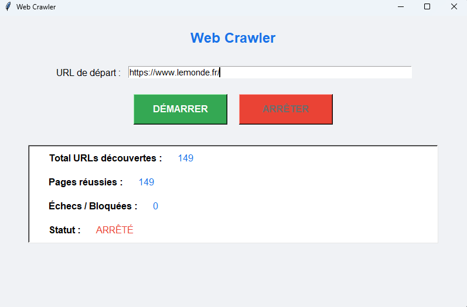

# 🕷️ Web Crawler Multi-Thread + GUI + Docker
Un crawler extensible avec interface graphique, docker et base MySQL et exploration récursive des liens.

### 📌 Présentation du projet

Ce projet est un web crawler Python capable de :

✔️ Explorer une URL de départ
✔️ Récupérer tous les liens présents sur la page
✔️ Suivre chaque lien découvert comme une "tentacule"
✔️ Enregistrer chaque page explorée dans MySQL
✔️ Fonctionner de manière asynchrone (asyncio) et parallélisée
✔️ Fournir une interface graphique Tkinter pour contrôler et visualiser la progression
✔️ S’exécuter dans un environnement Docker simple et portable


### 📦 Architecture du projet

```
project/
│
├── crawler/
│   ├── crawler.py       # logique du crawler asynchrone
│   ├── database.py      # connexion DB SQLAlchemy
│   ├── models.py        # modèles ORM (Page, etc.)
│   ├── logger.py        # configuration du logging
│
├── gui.py               # interface Tkinter
├── Dockerfile           # image Python
├── docker-compose.yml   # stack (crawler + MySQL)
└── requirements.txt
```

### 🔧 Fonctionnalités principales

🧭 Crawler

- Analyse HTML avec extraction des URLs

- Navigation récursive tant que de nouveaux liens sont trouvés

- Async/Await + file de tâches simultanées (max_tasks)

- Détection des pages en :

  - succès

  - échec

  - bloquées (403 / robots / timeout)

  - Base SQL pour éviter les doublons

### 🖥️ Interface graphique Tkinter

 - Champ pour entrer l’URL de départ

- Boutons Démarrer / Arrêter

- Statistiques en temps réel :

- Total des URLs découvertes

- Pages réussies

- Échecs / bloquées

- Statut du crawler

- Mise à jour automatique toutes les secondes

- Thread isolé pour le crawler (pas de blocage UI)

### 🐳 Docker

- Service MySQL persistant

- Service crawler Python avec volume partagé pour le code

- Environment variable DATABASE_URL

### 🔧 Setup 

Lancer le fichier run.bat

```@echo off
echo ============================================
echo  Lancement du Web Crawler + Tkinter
echo ============================================

REM ----- 1. Démarrage MySQL dans Docker -----
echo [1/4] Démarrage de la base MySQL...
docker compose up -d

REM ----- 2. Création du virtualenv -----
if not exist venv (
    echo [2/4] Création de l'environnement virtuel...
    python -m venv venv
)

REM ----- 3. Activation du virtualenv -----
echo [3/4] Activation de l'environnement...
call venv\Scripts\activate

REM ----- 4. Installation des dépendances -----
echo [4/4] Installation des dépendances Python...
pip install -r requirements.txt

REM ----- 5. Lancement du programme -----
echo Lancement du programme Tkinter...
python main.py

pause
```

### 🖥️ Interface visuel 

- Visuel 

- Db mysql sous docker
  
